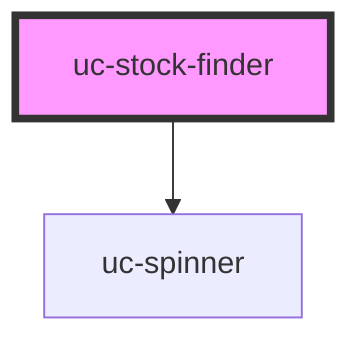

# uc-stock-finder

<!-- Auto Generated Below -->

## Properties

| Property      | Attribute     | Description | Type     | Default     |
| ------------- | ------------- | ----------- | -------- | ----------- |
| `placeholder` | `placeholder` |             | `string` | `undefined` |

## Events

| Event              | Description | Type                  |
| ------------------ | ----------- | --------------------- |
| `ucSymbolSelected` |             | `CustomEvent<string>` |

## Dependencies

### Depends on

- [uc-spinner](../spinner)

### Graph

----------------------------------------------

*Built with [StencilJS](https://stenciljs.com/)*
